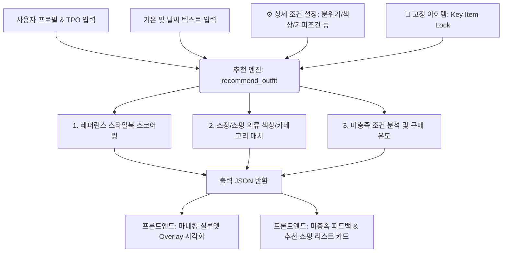

# 👗 AI 코디 추천 엔진 연동 및 UI/UX 시각화 스펙 가이드 (For Frontend Developer)

본 가이드는 백엔드에 구축된 **AI 코디 추천 엔진(Core Engine)**의 입출력 데이터를 프론트엔드 개발자가 이해하고, 이를 바탕으로 단순한 목업 수준을 넘어 **실제 상용 프리미엄 앱 수준의 UI/UX**를 설계 및 구현할 수 있도록 제작된 연동 사양서입니다.

> **[필독] 개발 철학:**
> 현재 제공되는 Streamlit 화면은 백엔드 엔진의 동작성 검증을 위한 최소한의 **기능적 프로토타입(Mockup)**입니다. 프론트엔드 개발자는 이 레이아웃을 그대로 복사하는 것이 아니라, 제공되는 입출력 JSON 데이터를 기반으로 사용자 중심의 감각적이고 유려한 모던 인터페이스(예: iOS/Android 네이티브 앱 또는 React/Vue 기반의 미니멀 대시보드)를 구성해야 합니다.

---

## 1. 데이터 흐름 아키텍처 (Data Flow)

추천 엔진은 사용자 입력 데이터(프로필, 날씨, 스타일 세부 기호)를 파싱하여 스타일 데이터베이스와 실시간 매칭을 진행하고, 소장 의류 및 구매 후보 의류를 조합한 최적의 코디 세트와 미충족 조건에 대한 구매 피드백을 전달합니다.



---

## 2. API 입출력 상세 규격 (API Specifications)

### ① 입력 파라미터 (Request Parameters)
엔진 함수 `recommend_outfit(...)`을 호출할 때 전달하는 파라미터 사양입니다.

| 파라미터명 | 타입 | 예시값 / 선택 범위 | 설명 |
| :--- | :--- | :--- | :--- |
| **`user_profile`** | `dict` | `{"gender": "여성", "age_job": "30대 회사원", "body_type": "하체 통통", "tpo": "하객"}` | 사용자의 기본 정보 및 방문 목적 |
| **`weather_info`** | `str` | `"기온 16도, 다소 쌀쌀함"` | 날씨 정보 (엔진 내부에서 기온 수치를 파싱하여 겨울/여름/환절기 의상 필터링) |
| **`recommend_mode`**| `str` | `"내 옷장만 추천"`, `"구매 후보만으로 가상 코디"`, `"내 옷장 + 구매 후보 믹스 추천"` | 코디 조합 대상 풀(Pool) 설정 |
| **`tpo_mood`** | `str` | `"💼 오피스 & 격식 (포멀/클래식)"`, `"☕ 데이트 & 소개팅"`, `"🏃 일상 & 애슬레저"`, `"🌴 여행 & 라운지"` | 오늘의 핵심 TPO 분위기 카테고리 |
| **`fixed_item_id`** | `str` | `"item_top_white"` 또는 `None` | **Key Item Lock**: 오늘 무조건 입을 의류의 고유 ID (해당 아이템을 기준으로 배색 조합 강제 적용) |
| **`desired_mood`** | `str` | `"선택 안 함"`, `"캐주얼"`, `"스트릿"`, `"포멀/클래식"`, `"미니멀"`, `"로맨틱/페미닌"`, `"레트로"` | 사용자가 강조하고 싶은 특정 무드 |
| **`formality_level`**| `str`| `"선택 안 함"`, `"높음 (정장/클래식)"`, `"보통"`, `"낮음"` | 상황의 격식 정도 (낮을수록 스포티/캐주얼에 가점) |
| **`preferred_color`**| `str`| `"선택 안 함"`, `"화이트"`, `"블랙"`, `"네이비"`, `"베이지"`, `"그레이"`, `"브라운"`, `"블루"` | 우선 매치할 선호 색상 |
| **`avoid_options`** | `list`| `["레드 색상", "아우터 제외", "원피스 제외", "스커트 제외"]` | 배색이나 카테고리에서 엄격하게 제외할 조건 목록 |
| **`activity_level`** | `str`| `"선택 안 함"`, `"높음"`, `"보통"`, `"낮음"` | 오늘의 야외 활동량 수준 |

---

### ② 출력 JSON 스키마 (Response Schema)
추천 성공 시 엔진이 반환하는 JSON 형태의 데이터 명세입니다.

```json
{
  "selected_reference": {
    "gender": "Woman",
    "style_name": "모던 놈코어 그레이 스타일 코디",
    "category_combination": "상의 + 하의",
    "color_combination": "그레이 계열",
    "mood": "심플하고 단정한 모던 놈코어 무드",
    "season": "봄, 가을",
    "style_tips": "이 스타일은 [티셔츠, 청바지] 아이템들을 매치하여 놈코어 감성을 연출한 완성도 높은 코디입니다.",
    "file_path": "datasets\\Woman\\images\\T_00123_19_normcore_W.jpg"
  },
  "items": [
    {
      "id": "c1",
      "category": "상의",
      "detail": "그레이 라운드넥 니트",
      "color": "그레이",
      "season": "봄, 가을",
      "style": "모던 놈코어",
      "file_path": "datasets\\MyCloset\\grey_knit.png",
      "is_shopping_candidate": false
    },
    {
      "id": "s2",
      "category": "하의",
      "detail": "블루 테이퍼드 청바지",
      "color": "블루",
      "season": "봄, 가을, 겨울",
      "style": "원마일 캐주얼",
      "file_path": "datasets\\ShoppingCandidates\\blue_jeans.png",
      "is_shopping_candidate": true,
      "price": 49000,
      "brand": "무신사 스탠다드",
      "url": "https://www.musinsa.com/..."
    }
  ],
  "score": 85,
  "reasons": [
    "TPO(주말 브런치 데이트)와 스타일북(모던 놈코어 무드) 매칭이 매우 우수합니다.",
    "그레이 상의와 블루 하의의 안정적인 톤온톤 배색 규칙을 적용했습니다."
  ],
  "warnings": [
    "날씨가 다소 쌀쌀하나 코디에 매칭할 만한 적합한 아우터가 옷장에 부족합니다."
  ],
  "unmet_conditions": [
    {
      "type": "preferred_color",
      "expected": "블랙",
      "reason": "소장하신 옷장 내에 그레이 스타일 가이드와 조화롭게 어울리는 블랙 색상 하의가 없어 청바지로 매칭을 대체했습니다."
    }
  ],
  "complementary_suggestions": [
    {
      "category": "아우터",
      "detail": "네이비 테일러드 자켓",
      "reason": "현재 날씨(16도)에 적합한 보온성을 확보하면서 모던 놈코어 무드를 더욱 살리기 위해 네이비 블레이저 자켓 추가 구매를 추천합니다."
    }
  ]
}
```

---

## 3. 프론트엔드 UI/UX 시각화 설계 가이드

프론트엔드 구현 시 프로토타입의 텍스트 기반 출력을 피하고, 사용자 친화적인 그래픽 화면을 구현하기 위해 다음 4가지 핵심 영역의 디자인 규칙을 제안합니다.

### 🎨 1) 마네킹 실루엣 Overlay 시각화 (Interactive Avatar View)
* **목업의 문제점**: 목업에서는 상/하단 단순 분할 격자 구조에 이미지 카드를 순서대로 렌더링하고 있습니다.
* **프론트엔드 구현안**:
  * 화면 중앙에 투명한 인체 실루엣(Mannequin Avatar) SVG 또는 Canvas를 배치합니다.
  * `items` 배열의 각 의상 오브젝트를 읽어와서 카테고리에 맞는 아바타 좌표 위에 **의상 이미지(PNG/SVG)를 레이어 형태로 Overlay**하여 실제 입은 듯한 느낌을 줍니다.
  * 아우터 입기/벗기(Toggle) 상호작용 버튼을 제공하여, `is_shopping_candidate` 상태에 따라 소유하고 있는 옷은 실선으로, 구매 후보 옷은 점선이나 빛나는 효과(Glow/Glassmorphism)로 아바타 위에 시각화합니다.

```
+---------------------------------------+
|          [ 오늘의 AI 아바타 ]          |
|                                       |
|                / \   <- [🧥 아우터 점선: 쇼핑후보]
|               /| | \                  |
|              / | |  \                 |
|                | |   <- [👕 상의 실선: 내옷장]
|                | |                    |
|                | |                    |
|               /   \  <- [👖 하의 실선: 내옷장]
|              /     \                  |
|                                       |
|       [🧥 아우터 입어보기 토글 스위치]   |
+---------------------------------------+
```

### 📌 2) 드래그 앤 드롭 옷장 고정 UI (Key Item Lock)
* **목업의 문제점**: 드롭다운 셀렉트박스로 텍스트 리스트에서 고를 옷을 선택해야 해서 내 옷에 무엇이 있는지 인지가 어렵습니다.
* **프론트엔드 구현안**:
  * 화면 하단 또는 별도의 슬라이드 드로어(Bottom Sheet)에 '내 디지털 옷장'을 격자형 이미지 갤러리로 배치합니다.
  * 사용자가 특정 상의나 아우터를 손가락으로 누르고 **마네킹 아바타 영역으로 드래그 앤 드롭**하면, 해당 아이템의 ID를 `fixed_item_id`로 설정하여 즉시 고정하고 실시간 추천을 다시 수행합니다.
  * 고정된 아이템 카드 우측 상단에는 자물쇠 모양 아이콘(`🔒`) 또는 핀 배지가 나타나 시각적 직관성을 제공합니다.

### 🛒 3) 커머스 연동형 구매 가이드 카드 (E-Commerce Integrated Cards)
* **목업의 문제점**: 상품 정보가 텍스트와 단순 하이퍼링크로 표시되어 있어 정보 탐색이 끊깁니다.
* **프론트엔드 구현안**:
  * `items` 중 `is_shopping_candidate`가 `true`이거나 `complementary_suggestions` 리스트에 있는 상품들은 쇼핑 쇼케이스 카드로 렌더링합니다.
  * 카드에는 **브랜드 로고, 실시간 최저가, 쇼핑몰 바로가기 단축키(CTA 버튼)**를 배치하고, "내 옷장의 OO 아이템과 85% 어울림"과 같은 친절한 스타일 매치율 배지를 탑재합니다.
  * 위시리스트 저장 버튼 및 장바구니 아이콘을 직접 매칭하여 코디에서 바로 결제로 이어지는 커머스 전환율을 향상시킵니다.

### ⚠️ 4) 미충족 조건의 긍정적 피드백 시각화 (Unmet Criteria Tooltip)
* **목업의 문제점**: 조건 미달 시 단순한 문자열 경고로만 보여 불만족스러운 인상을 줍니다.
* **프론트엔드 구현안**:
  * 사용자가 원했던 조건(예: 선호 색상 "블랙")이 매칭되지 않았을 때, 경고 문구 대신 **"아쉽게도 블랙 색상의 바지가 옷장에 없어요. 하지만 이 그레이 청바지를 활용해도 충분히 세련된 놈코어 연출이 가능합니다!"**라는 툴팁(Tooltip) 혹은 챗봇 가이드 말풍선 형태로 정중하게 대안을 설명합니다.
  * 충족되지 못한 조건 텍스트 옆에 돋보기 아이콘을 눌러, 즉시 해당 조건에 맞는 쇼핑몰 아이템들을 검색 탭으로 연동해 보여주는 스마트 검색 브릿지를 제공합니다.
